# Guidelines for Starting the Project

## Description
This document provides a step-by-step guide to set up and run the OpenCTI and N8N Docker environment locally. It also includes instructions for importing data into OpenCTI for testing purposes.

# OpenCTI

---

## Step-by-Step Guide

### Shellcode Example

```bash
#!/bin/bash

# Update and install dependencies for Docker Compose
sudo apt update && sudo apt install -y docker.io docker-compose

# Clone the repository
git clone https://github.com/your-repo/openctin8ndocker.git
cd openctin8ndocker

# Start the Docker containers
docker-compose up -d
```

This will start all containers locally. Here are the URLs to access the services:

- **OpenCTI UI**: [http://localhost:8080/dashboard](http://localhost:8080/dashboard)  
  Credentials: `admin@opencti.io / changeme`
- **N8N UI**: [http://localhost:5678/](http://localhost:5678/)  
  Credentials: `test@email.com / OpenCti2025`

---

## Additional Information

### Mitre STIX IoCs
For OpenCTI, we are including Mitre STIX IoCs from the following repository:  
[https://github.com/mitre-attack/attack-stix-data/tree/master/](https://github.com/mitre-attack/attack-stix-data/tree/master/)

---

## Optional: Load Data for the First Time
This step is optional and demonstrates how to import data into OpenCTI to have extra data for testing. Note that using a large STIX file may cause performance issues in this local test environment.

### Steps to Import Data

1. **Go to Import -> Import Files**
   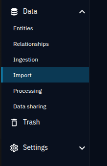

2. **Select "Direct / Automatic" Import**
   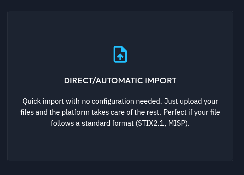

3. **Select the File and Click Next**
   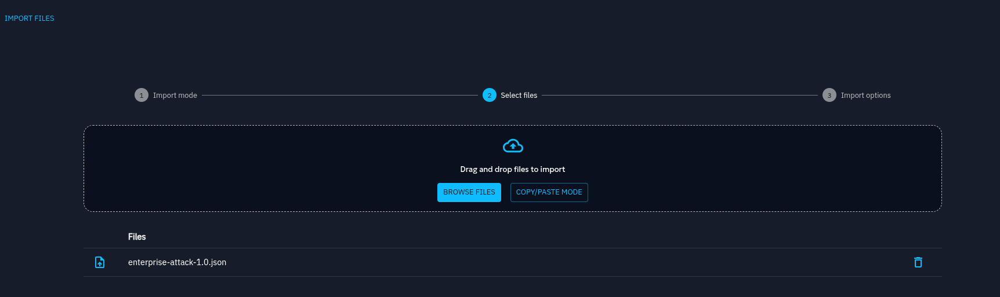  
   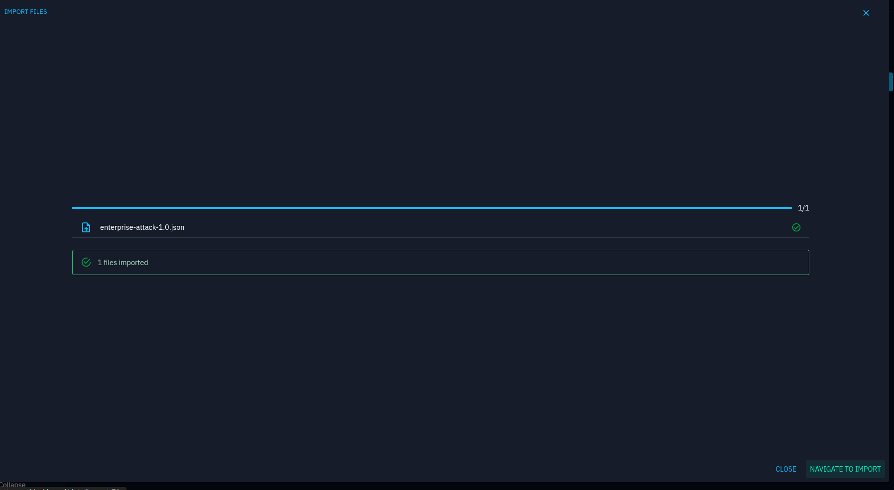

4. **Go to Import -> Analysts Workbenches**
   - Click on the imported file.
   - Validate the workbench.

5. **Click on "Validate This Workbench" to Load the Data**
   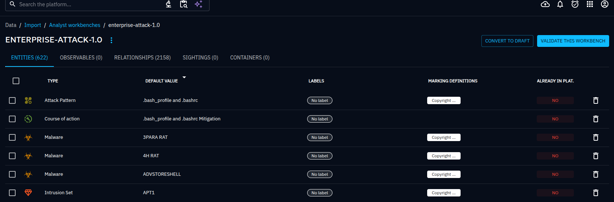  
   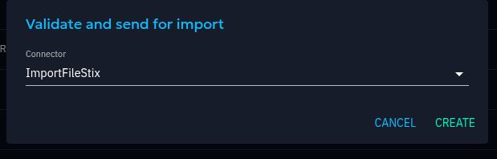

---

*Note*: We used a small STIX file from Mitre for better performance. Using a larger file may slow down OpenCTI in this local test environment.


# N8N

How to get a Gemini API key?
### Steps to Get a Gemini API Key from Google AI Studio

1. **Sign in to Google AI Studio**  
    Go to [Google AI Studio](https://aistudio.google.com/app/api-keys) and log in with your Google account.

2. **Navigate to the API Keys Section**  
    In the dashboard, click on the "API Keys" tab in the left-hand menu.

3. **Create a New API Key**  
    - Click on the "Create API Key" button.
    - Provide a name for your API key (e.g., "deathcon25").
    - If it is required, create a project called deathcon25 too.

4. **Set Permissions**  
    - Select the required permissions for the Gemini API.
    - Click "Save" to confirm.

5. **Copy the API Key**  
    - Once the key is generated, copy it to a secure location.
    - Use this key in your N8N workflows for Gemini integration.

*Note*: Keep your API key confidential and do not share it publicly.


### In N8N:

1. Go to Credentials
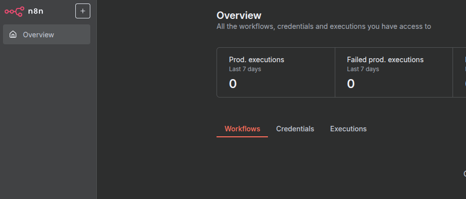

2. Add first credential

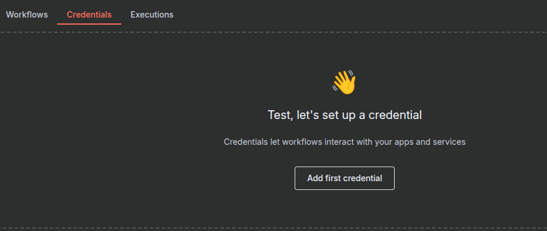

    - Select "Google Gemini(PaLM) Api"
    - Copy your API Key and Save it

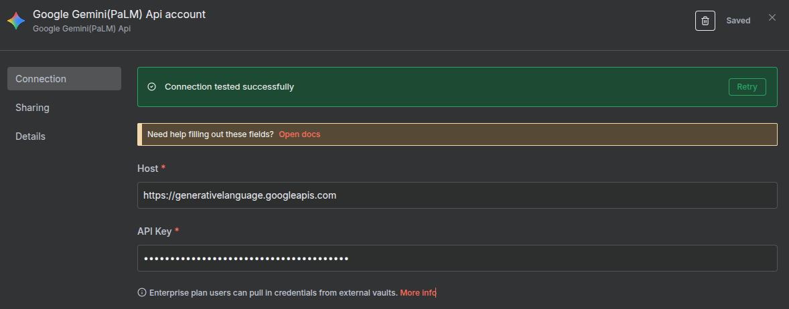


3. Go to Workflows and select Test a Simple AI agent

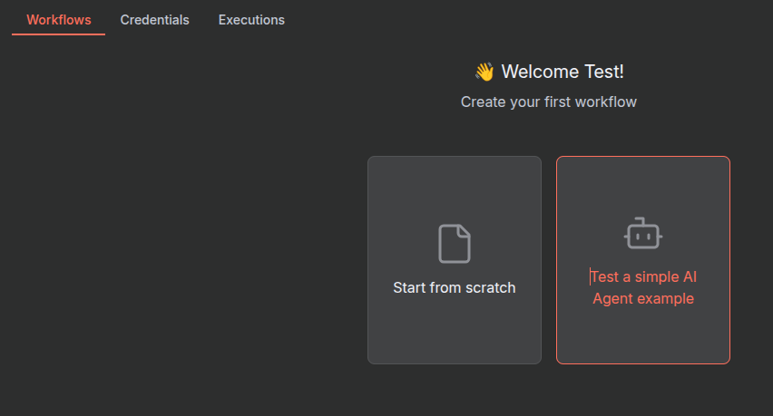

4. Delete the current OpenAI connection (unless you want to use yours)
5. Add a new Model from Gemini
6. Add a Simple Memory


### Create an OpenCTI API Credential

1. Create a credential for OpenCTI API access

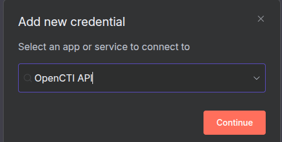

2. In OpenCTI:

Go to Profile → Tokens (top-right corner → your username → “Profile”).

Click “+” or “Generate new token.”

Copy the token — it starts with eyJ....

That’s your API token for use with OpenCTIApiClient or n8n.

3. Set the token

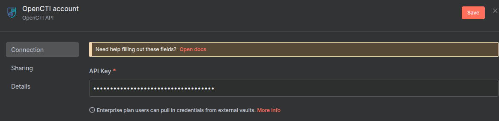

